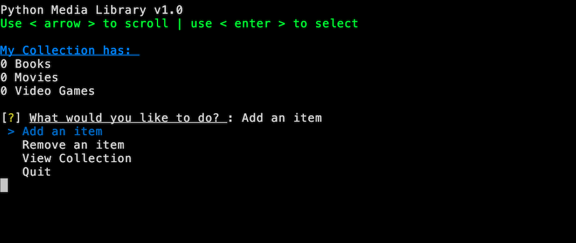
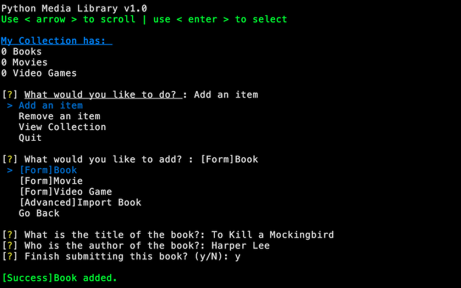
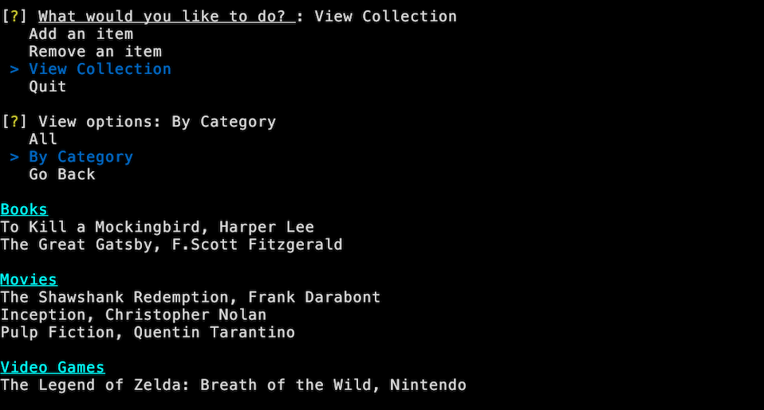

# Media Library CLI Application





## Table of Contents

- [Description](#description)
- [Features](#features)
- [Technologies Used](#technologies-used)
- [Installation](#installation)
- [Usage](#usage)
- [Contributing](#contributing)
- [License](#license)

## Description

The Media Library CLI Application is a command-line interface (CLI) library management tool built using Python. It allows users to manage their media library, including books, movies, and video games. Users can view the contents of the library, remove items, and update items as needed.

Users have two options to add books to the library:

1. **Manual Entry:** Users can manually enter book details by filling out a form within the application. This allows for custom information entry and provides flexibility in adding diverse types of media.

2. **ISBN Lookup:** Alternatively, users can enter an ISBN number for a book. The application fetches book information from the Google Books API based on the ISBN provided. Users are then presented with the fetched information and can confirm whether the details are correct before adding the book to the library.

## Features

- Add, remove, and update books, movies, and video games in the library.
- View the contents of the library.
- Seamless integration with a server microservice for enhanced functionality.

## Technologies Used

- Python
- TCP Sockets
- Google Books API
- Inquirer
- dotenv

## Installation

1. Clone the repository:

```bash
git clone https://github.com/alexcw08/LibraryProject.git
```
